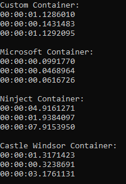

# Enterprise FizzBuzz
An enterprise edition of the FizzBuzz game in C#

[Build Status](https://travis-ci.com/MarkSFrancis/EnterpriseFizzBuzz)


## FizzBuzz

This core library represents the core-most parts and logic for FizzBuzz. It contains a single service: `FizzBuzzService` which can be configured via the constructor to play any variance of FizzBuzz

## FizzBuzz.DependencyInjection

Dependency injection is built custom for this application, and so an entire start-up engine, service provider and service builder is built in.

All applications should start with the following:
1. Construct an instance of `FizzBuzzEngine` with your instance of `IStartup`
1. Initialise the `FizzBuzzEngine` and any services your `IStartup` needs by calling `Build()` on your instance of `FizzBuzzEngine`
1. Run the application by calling either `Run` or `RunAsync` on your instance of `FizzBuzzEngine`. `Run` will stop further execution until your `IStartup` is finished executing.

Application state is managed via a provided implementation of `IStartup`, which is called after the `FizzBuzzEngine` has done any necessary start up.

You can add any core required parameters for startup into the constructor for your `IStartup` implementation, these will be injected automatically for you by the engine.

The following services are provided by default in `FizzBuzzEngine`:

* `IFizzBuzzService`
* `IServiceFactory`

Your `IStartup` can depend on any combination of these (including none or all).

Your `IStartup` can also replace either of these items with its own instances in the `AddServices` method - just add them as if they weren't already present, and you'll overwrite the existing instances

```cs
// Sample program.cs
internal class Program
{
    public static void Main()
    {
        var engine = new FizzBuzzEngine<Startup>();

        engine.Build();
        engine.Run();
    }
}
```

```cs
// Sample startup.cs
public class Startup : IStartup
{
    public void AddServices(IServiceContainer container)
    {
        container.AddSingleton<IConsoleIo, ConsoleIo>();
        container.AddSingleton<IFizzBuzzConsole, FizzBuzzConsole>();
        container.AddSingleton<IFizzBuzzApp, FizzBuzzApp>();
    }

    public Task Run(IServiceFactory factory)
    {
        IFizzBuzzApp app = factory.Get<IFizzBuzzApp>();

        return app.Run();
    }
}
```

## FizzBuzz.DependencyInjection.Abstractions

This library represents abstractions of DependencyInjection. Any core libraries that want to extend DependencyInjection should inherit from this, not the base DependencyInjection

## FizzBuzz.DependencyInjection.Benchmarks

One of the most important things with any dependency injection container is performance.
Ths custom DI container for this project is one of the fastest available - second only to Microsoft.DependencyInjection when the most popular containers are compared against it.

> Latest results are as follows:
> * The first time is for 1,000,000 resolves of Service 1. Service 1 is a simple transient service with 0 dependencies
> * The second is for 1,000,000 resolves of Service 2. Service 2 is a singleton service with a single dependency of Service 1
> * The third is for 1,000,000 resolves of Service 3. Service 3 is a transient service with a single dependency of Service 2
>
> 

Please note that the benchmarked times **do not** include the time it takes to register dependencies, only resolving them.

## FizzBuzz.Logs

This is a custom logging library, which by default, logs to Console and the Debug window. You can add your own custom logging by creating a service which implements `FizzBuzz.Logs.Outputs.ILogOutput` and adding it in the configuration when calling `AddLogging` on your application's `IServiceContainer`.

```cs
// Sample output log
public class ConsoleLog : ILogOutput
{
    public void WriteError(string message)
    {
        WriteLineInColor(message, ConsoleColor.Red);
    }

    public void WriteInfo(string message)
    {
        WriteLineInColor(message, ConsoleColor.White);
    }

    public void WriteTrace(string message)
    {
        WriteLineInColor(message, ConsoleColor.Cyan);
    }

    public void WriteWarning(string message)
    {
        WriteLineInColor(message, ConsoleColor.Yellow);
    }

    private void WriteLineInColor(string message, ConsoleColor color)
    {
        var initialColor = Console.ForegroundColor;

        Console.ForegroundColor = color;
        Console.WriteLine(message);

        // Reset color
        Console.ForegroundColor = initialColor;
    }
}
```

The logging container also supports local configuration to control log levels for specific areas of your code, applications, or 3rd party logs

```cs
// Sample set up (requires using FizzBuzz.Logs)
container.AddLogging((serviceFactory, setup) =>
{
    // Set the default global minimum log level
    setup.SetMinimumLogLevel(LogLevel.Trace);

    // Set local log levels for specific log sources.
    // These override the default for the relevant services
    setup.SetMinimumLogLevel(LogLevel.Warning, "Microsoft");
    setup.SetMinimumLogLevel(LogLevel.Warning, "System");

    // Add any logging outputs for your app
    setup.AddOutput<ConsoleLog>();
});
```

## FizzBuzz.Console

This is a console implementation of the FizzBuzz game, with the necessary services required for console input/output.

`Startup` manages setting up dependencies and application configuration

`IFizzBuzzApp` manages running the application

`IFizzBuzzConsole` manages FizzBuzz specific input and output to the console

`IConsoleIo` manages all console input and output

## FizzBuzz.Api

This is an ASP NET Core implementation of the FizzBuzz game, with any route resolving to the FizzBuzz game.

The query string variable `from` specifies the range start for FizzBuzz (inclusive), and defaults to `1`. The query string variable `total` specifies how many numbers to retrieve, and defaults to `20`

### Examples:

> `https://localhost:44306/?from=10&total=5`
>
> Would retrieve: `Buzz, 11, Fizz, 13, 14`

> `https://localhost:44306/`
>
> Would retrieve: `1, 2, Fizz, 4, Buzz, Fizz, 7, 8, Fizz, Buzz, 11, Fizz, 13, 14, FizzBuzz, 16, 17, Fizz, 19, Buzz`
